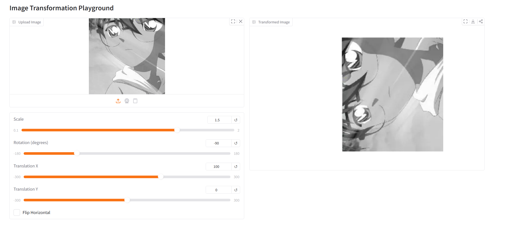
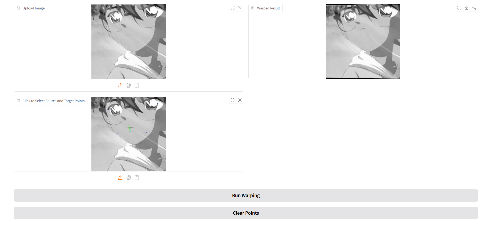

#  Image Warping

 This repository is my implementation of Assignment_01 of DIP.

##  Implementation Overview

In this assignment, basic geometric transformations and point-based image deformation are implemented.

### 1. Basic Global Transformation
- **Core Logic**: Constructs a composite affine matrix by chaining scale, rotation, translation, and flip operations **around the image center**.
- **Details**: Uses homogeneous coordinates (3x3) for matrix multiplication, then extracts the 2x3 matrix for `cv2.warpAffine`.

### 2. Point Guided Deformation (MLS)
- **Algorithm**: Implements **Moving Least Squares (MLS)** rigid deformation.
- **Optimization**: Pixels are processed in batches to compute weighted centroids and solve for the optimal local transformation, ensuring memory efficiency.
- **Reference**: [Image Deformation Using Moving Least Squares](https://people.engr.tamu.edu/schaefer/research/mls.pdf).

##  Requirements

To install requirements:

```bash
python -m pip install -r requirements.txt
```

##  Running the Code

### Basic Global Transformation
Adjust sliders to rotate, scale, and flip the image in real-time.
```bash
python run_global_transform.py
```

### Point Guided Deformation
Click to set source (blue) and target (red) points, then execute warping.
```bash
python run_point_transform.py
```

##  Results

### Basic Transformation
*Demonstrates real-time interactive control over global geometry.*



### Point Guided Deformation
*Shows smooth local deformation based on control point pairs.*



---

