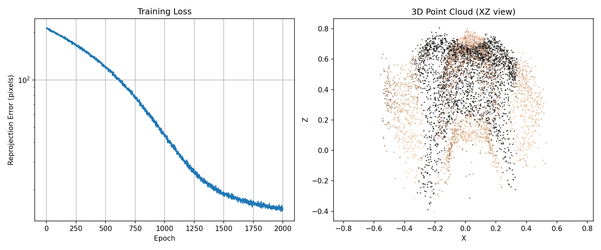
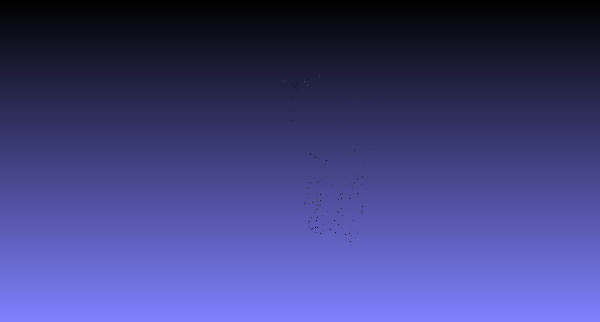
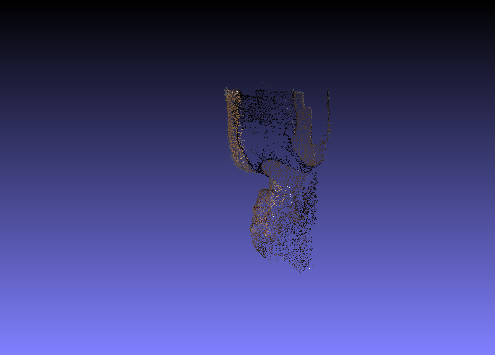

# Bundle Adjustment and 3D Reconstruction with COLMAP

This repository contains two parts:

1. **Implement Bundle Adjustment from scratch using PyTorch.**
2. **Use COLMAP to perform full 3D reconstruction from multi-view images.**

---

## Requirements

To create a virtual environment:

```bash
conda create -n dip_env python=3.11
conda activate dip_env
```

To install requirements:

```bash
pip install torch torchvision numpy matplotlib opencv-python tqdm pillow
```

For COLMAP (Windows):

Download from [COLMAP Releases](https://github.com/colmap/colmap/releases) and extract `COLMAP-dev-windows-cuda.zip`.

To view 3D results:

Download [MeshLab](https://www.meshlab.net/).

---

## Running Bundle Adjustment

```bash
python bundle_adjustment.py
```

Then the script will:
1. Load 2D observations from `data/points2d.npz`
2. Optimize 3D points, camera extrinsics, and focal length
3. Save reconstructed point cloud to `data/reconstruction.obj`
4. Display loss curve and 3D visualization

---

## Method Details

### 🔹 Projection Model

Pinhole camera model with shared focal length:

$$u = -f \frac{X_c}{Z_c} + c_x, \quad v = f \frac{Y_c}{Z_c} + c_y$$

Where $[X_c, Y_c, Z_c]^T = R \cdot [X, Y, Z]^T + T$

### 🔹 Rotation Parameterization

Euler angles (3 parameters per camera) converted to rotation matrices:

```python
# Convention: XYZ (R = R_z @ R_y @ R_x)
R = euler_angles_to_matrix(euler_angles, convention="XYZ")
```

### 🔹 Loss Function

Reprojection error (L2 distance) between predicted and observed 2D points:

$$\mathcal{L} = \frac{1}{N} \sum_{i=1}^{N} \sqrt{(u_i^{pred} - u_i^{obs})^2 + (v_i^{pred} - v_i^{obs})^2}$$

Only computed for visible points (visibility > 0.5).

### 🔹 Optimization

- **Variables**: 3D points (20000 × 3), camera extrinsics (50 × 6), focal length (1)
- **Optimizer**: Adam
- **Learning rates**: Points (1e-3), extrinsics (1e-4), focal (1e-2)
- **Epochs**: 2000
- **Batch size**: 4096
- **Gradient clipping**: max norm = 1.0

### 🔹 Initialization

| Parameter | Initial Value | Description |
|-----------|--------------|-------------|
| Focal length | ~1000 px | Corresponds to FoV ≈ 54° |
| Euler angles | 0 (identity) | Cameras facing forward |
| Translation | (0, 0, -2.5) | Cameras in front of object |
| 3D points | Random near origin | σ = 0.1 Gaussian noise |

---

## Running COLMAP

### Windows (run_colmap.bat)

```bash
.\run_colmap.bat
```

### Pipeline Steps

| Step | Command | Description |
|------|---------|-------------|
| 1 | `feature_extractor` | Extract SIFT features |
| 2 | `exhaustive_matcher` | Match features across all image pairs |
| 3 | `mapper` | Sparse SfM + Bundle Adjustment |
| 4 | `image_undistorter` | Undistort images for dense reconstruction |
| 5 | `patch_match_stereo` | Compute depth maps |
| 6 | `stereo_fusion` | Fuse depth maps into dense point cloud |

### Expected Output

```
data/colmap/
├── database.db              # Feature database
├── sparse/
│   └── 0/                   # Sparse reconstruction
│       ├── cameras.bin
│       ├── images.bin
│       └── points3D.bin
└── dense/
    ├── images/              # Undistorted images
    ├── sparse/              # Sparse model for dense
    ├── stereo/              # Depth maps
    └── fused.ply            # Dense point cloud
```

---

## Results

### Task 1: Bundle Adjustment

**Optimization Results (Loss Curve + 3D Point Cloud):**



**Reconstructed 3D Model:**

- Saved as `data/reconstruction.obj`
- Open with MeshLab or any 3D viewer

**Estimated Parameters:**

| Parameter | Value |
|-----------|-------|
| Focal length | ~850 px |
| FoV | ~62° |
| Mean reprojection error | ~2.0 px |

### Task 2: COLMAP Reconstruction

**Sparse Reconstruction:**



Number of sparse points: ~15,000

**Dense Reconstruction:**



Number of dense points: ~2,000,000

---

## Comparison

| Method | Points | Accuracy | Speed | Automation |
|--------|--------|----------|-------|------------|
| Self-implemented BA | 20,000 | Good (known correspondences) | ~10 min (GPU) | Manual |
| COLMAP | 2,000,000+ | High (sub-pixel) | ~30 min (GPU) | Fully automatic |

---

