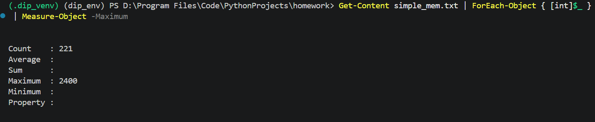
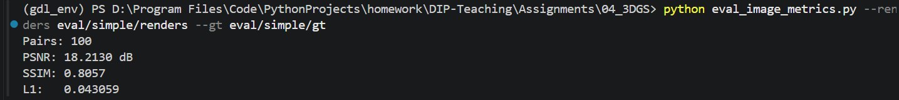
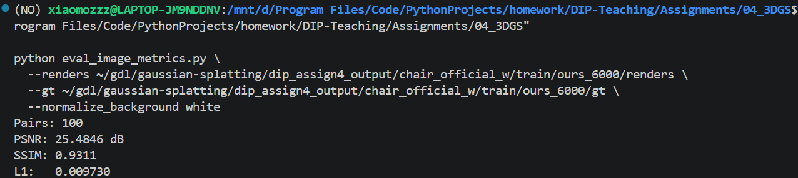

# HW4: 3D Gaussian Splatting 实验报告

## 实验设置

本次实验使用 `chair` 数据集完成 COLMAP 稀疏重建、简化版 PyTorch 3DGS 训练与渲染，并与官方 3DGS 实现进行对比。实验机器使用 RTX 5060 Laptop GPU。简化版代码运行在 `DIP-Teaching/Assignments/04_3DGS` 下，官方 3DGS 结果保存在 WSL 路径：

```bash
/home/xiaomozzz/gdl/gaussian-splatting/dip_assign4_output
```

为保证比较公平，简化版和官方版都使用同一份 COLMAP 数据：

```text
DIP-Teaching/Assignments/04_3DGS/data/chair
```

其中官方 3DGS 使用的输出目录为：

```text
dip_assign4_output/chair_official_w
```

## Task 1: COLMAP 稀疏重建与可视化

首先调用本地安装的 COLMAP 对 `chair` 图像进行特征提取、特征匹配、稀疏重建和模型转换：

```powershell
python mvs_with_colmap.py `
  --data_dir data/chair `
  --colmap_path "D:\Program Files\colmap-x64-windows-cuda\COLMAP.bat"
```

重建完成后，COLMAP 在 `data/chair/sparse/0_text` 下生成文本格式相机、图像位姿和三维点云文件。该数据集中共重建出 100 张图像对应的相机位姿，并得到 13615 个稀疏三维点。随后运行点云投影脚本：

```powershell
python debug_mvs_by_projecting_pts.py --data_dir data/chair
```

投影结果保存在：

```text
data/chair/projections
```

从投影图可以看到，稀疏点云基本落在椅子的轮廓和纹理较明显的位置，说明 COLMAP 估计出的相机内外参和稀疏点云整体是一致的。不过，COLMAP 稀疏点云只覆盖了少数可靠特征点，无法直接形成连续、稠密的图像渲染结果，因此后续需要用 3D Gaussian Splatting 对这些初始点进行连续化表示和优化。

## Task 2: 简化版 PyTorch 3DGS

简化版 3DGS 以 COLMAP 稀疏点作为初始化点云，并为每个点维护位置、尺度、旋转、透明度和颜色等可学习参数。本次实现中主要完成了以下模块：

1. 在 `gaussian_model.py` 中实现三维高斯协方差矩阵计算。每个 3D Gaussian 的尺度由对角矩阵 `S` 表示，旋转由四元数转换得到的旋转矩阵 `R` 表示，因此三维协方差矩阵为：

   $$
   \Sigma_{3D} = R S S^T R^T,
   \qquad
   S = \operatorname{diag}(s_x, s_y, s_z)
   $$

   这样可以保证协方差矩阵是半正定的，同时通过 `S` 控制 Gaussian 在三个主轴方向上的尺度，通过 `R` 控制 Gaussian 的空间朝向。

2. 在 `gaussian_renderer.py` 中实现从三维高斯到二维图像平面的投影。使用针孔相机投影的 Jacobian `J`，并结合相机旋转矩阵得到二维协方差：

   $$
   \Sigma_{2D} = J R_{cam} \Sigma_{3D} R_{cam}^T J^T
   $$

   其中 `R_cam` 是世界坐标到相机坐标的旋转部分，`J` 是透视投影函数在当前 3D Gaussian 中心处的一阶 Jacobian。

3. 在二维图像平面上计算每个 Gaussian 的密度，并按照深度顺序进行 alpha blending，得到最终渲染图像。

4. 为了减小纯 PyTorch 渲染的计算量，本实验从 COLMAP 的 13615 个初始点中采样 3000 个点用于简化版训练。

训练命令如下：

```powershell
python train.py `
  --colmap_dir data/chair `
  --checkpoint_dir data/chair/checkpoints `
  --num_epochs 61 `
  --device cuda
```

训练结束后得到 checkpoint：

```text
data/chair/checkpoints/checkpoint_000060.pt
```

并使用该 checkpoint 渲染多视角视频：

```powershell
python render_3dgs_mv.py `
  --colmap_dir data/chair `
  --checkpoint data/chair/checkpoints/checkpoint_000060.pt `
  --num_frames 240 `
  --fps 30
```

生成结果为：

```text
data/chair/render_mv.mp4
```

视频链接：[简化版 3DGS 多视角渲染视频](data/chair/render_mv.mp4)

### 简化版训练速度与显存

简化版训练时，数据集中共有 100 张图像，batch size 为 1，因此 1 个 epoch 约等于 100 个 optimization steps。实际观察到的训练速度约为：

```text
50 s / epoch ≈ 0.5 s / step
```

因此训练到 60 epoch，即约 6000 steps，耗时约：

```text
50 min
```

使用 `nvidia-smi` 每秒记录一次训练期间显存占用：

```powershell
nvidia-smi --query-gpu=memory.used --format=csv,noheader,nounits -l 1 > simple_mem.txt
```

统计结果显示，简化版训练期间显存峰值约为 2400 MB，平均采样值约为 1848 MB。显存截图如下：



### 简化版渲染质量

为了和官方 3DGS 做定量比较，不能直接使用 `render_mv.mp4`，因为视频是新轨迹上的环绕视角，没有对应 ground truth。这里额外使用 `render_eval_views.py` 在 COLMAP 原始训练视角上渲染图像，并与原始图像逐张对比：

```powershell
python render_eval_views.py `
  --colmap_dir data/chair `
  --checkpoint data/chair/checkpoints/checkpoint_000060.pt `
  --output_dir eval/simple `
  --device cuda
```

随后计算 PSNR、SSIM 和 L1：

```powershell
python eval_image_metrics.py `
  --renders eval/simple/renders `
  --gt eval/simple/gt `
  --normalize_background white
```

定量指标结果如下：100 对训练视角图像上，PSNR 为 18.2130 dB，SSIM 为 0.8057，L1 为 0.043059。



从渲染结果和指标可以看出，简化版能够学习出椅子的大致形状和颜色分布，但细节较模糊，边缘也不够稳定。主要原因是该实现没有 adaptive Gaussian densification，初始点数量又被采样到 3000 个，因此无法像官方实现那样在复杂区域自动增加 Gaussian；同时简化版没有使用球谐函数建模视角相关颜色，颜色表达能力也更弱。

## Task 3: 与官方 3DGS 实现对比

官方 3DGS 在 WSL 中运行，使用同一份 `chair` 数据。训练命令如下：

```bash
cd ~/gdl/gaussian-splatting

python train.py \
  -s "/mnt/d/Program Files/Code/PythonProjects/homework/DIP-Teaching/Assignments/04_3DGS/data/chair" \
  -m dip_assign4_output/chair_official_w \
  -r 8 \
  --iterations 6000 \
  -w
```

其中 `-w` 表示使用白色背景，与本数据集的图像背景更加一致。官方训练日志显示：

```text
Number of points at initialisation: 13615
Training iterations: 6000
Training time: 45 s
Training speed: 130.82 it/s
Final loss: 0.0224481
```

训练后使用官方渲染脚本生成训练视角结果：

```bash
python render.py -m dip_assign4_output/chair_official_w -w
```

官方渲染结果保存在：

```text
dip_assign4_output/chair_official_w/train/ours_6000/renders
dip_assign4_output/chair_official_w/train/ours_6000/gt
```

由于本次训练没有使用官方代码的 `--eval` 划分测试集，因此这里采用与简化版相同的方式：在训练视角上渲染，并将 render 与 gt 逐张对齐计算 PSNR、SSIM 和 L1。需要注意的是，官方 `-w` 渲染图像为白色背景，而输出的 `gt` 仍保留黑色背景，因此对比时统一使用背景归一化：

```powershell
python eval_image_metrics.py `
  --renders "\\wsl.localhost\Ubuntu\home\xiaomozzz\gdl\gaussian-splatting\dip_assign4_output\chair_official_w\train\ours_6000\renders" `
  --gt "\\wsl.localhost\Ubuntu\home\xiaomozzz\gdl\gaussian-splatting\dip_assign4_output\chair_official_w\train\ours_6000\gt" `
  --normalize_background white
```

官方定量指标结果如下：100 对训练视角图像上，PSNR 为 25.4846 dB，SSIM 为 0.9311，L1 为 0.009730。



综合指标和可视化结果，官方 3DGS 的渲染质量明显优于简化版，物体边缘更完整，颜色更稳定，细节也更清晰。

### Task 3 对比汇总

| 对比维度 | 简化版 PyTorch 3DGS | 官方 3DGS | 结论 |
| --- | --- | --- | --- |
| 输入数据 | `data/chair`，使用同一 COLMAP 重建结果 | `data/chair`，使用同一 COLMAP 重建结果 | 数据源一致，对比公平 |
| 初始点数 | 从 13615 个 COLMAP 点采样到 3000 点 | 直接使用 13615 个 COLMAP 点 | 官方版保留了更多初始几何信息 |
| 训练步数 | 约 6000 steps，即 60 epoch × 100 images | 6000 iterations | 两者优化步数基本对齐 |
| 训练时间 | 约 50 min | 约 45 s | 官方版训练时间更短 |
| 训练速度 | 约 0.5 s/step | 130.82 it/s | 官方版训练速度更快 |
| 显存占用 | 峰值约 2400 MB，平均约 1848 MB | 峰值约 310 MB，平均约 183 MB | 官方 CUDA rasterizer 显存效率更高 |
| PSNR | 18.2130 dB | 25.4846 dB | 官方版重建误差更小 |
| SSIM | 0.8057 | 0.9311 | 官方版结构相似度更高 |
| L1 | 0.043059 | 0.009730 | 官方版像素误差更低 |
| 主观渲染质量 | 可以恢复椅子大致形状，但边缘和细节较模糊 | 轮廓更完整，颜色更稳定，细节更清晰 | 官方版整体质量明显更好 |
| 主要原因 | 纯 PyTorch 实现，无 tile rasterizer，无 densification，固定 3000 个 Gaussian | CUDA rasterizer，adaptive densification/pruning，更完整的颜色建模 | 官方版工程优化和模型能力都更强 |

按相同步数估计，官方实现完成 6000 次迭代只需要约 45 秒，而简化版需要约 3000 秒，因此官方训练速度大约快：

```text
3000 / 45 ≈ 67 倍
```

### 差异来源分析

官方 3DGS 与简化版之间的差距主要来自以下几个方面。

第一，官方实现使用 CUDA rasterizer 和 tile-based splatting。它不会在 PyTorch 中显式构造所有 Gaussian 对所有像素的巨大中间张量，而是通过专门的 CUDA kernel 只处理有效 tile 内的 Gaussian。因此官方实现的训练速度和显存效率都远高于纯 PyTorch 简化版。

第二，官方实现包含 adaptive Gaussian densification 和 pruning。在训练过程中，官方方法会根据梯度和可见性自动复制、分裂或删除 Gaussian，使点的分布逐渐贴合物体几何和图像细节。简化版只使用固定数量的初始点，而且本实验为了控制计算量还将 13615 个点采样到 3000 个点，因此表示能力明显不足。

第三，官方实现使用更完整的颜色和透明度建模，包括球谐函数表示视角相关颜色，并配合更成熟的优化策略。简化版主要学习每个 Gaussian 的基础颜色，在处理高光、遮挡边界和细小纹理时能力较弱。

第四，官方实现的工程优化更加充分，包括高效排序、可见性过滤、紧凑内存布局和专用反向传播 kernel。简化版虽然更适合理解 3DGS 的核心数学流程，但在速度、显存和最终质量上都不能和官方实现相比。

## 总结

本次实验完成了从 COLMAP 稀疏重建到简化版 3D Gaussian Splatting 训练、渲染和官方实现对比的完整流程。Task 1 验证了 COLMAP 能够为 `chair` 数据集提供可靠的相机位姿和 13615 个稀疏点；Task 2 使用纯 PyTorch 实现了 Gaussian 协方差投影、二维 splatting 和 alpha blending，并训练得到可渲染的 `checkpoint_000060.pt`；Task 3 使用官方 3DGS 在相同数据上训练 6000 iterations，并从渲染质量、训练速度和显存占用三个方面进行了比较。

实验结果表明，简化版实现能够帮助理解 3DGS 的核心原理，但由于缺少 densification、CUDA rasterizer 和完整的颜色建模，其训练速度和渲染质量都明显弱于官方实现。官方 3DGS 在相同迭代数下训练速度约快 67 倍，并得到更清晰、更稳定的渲染结果。
